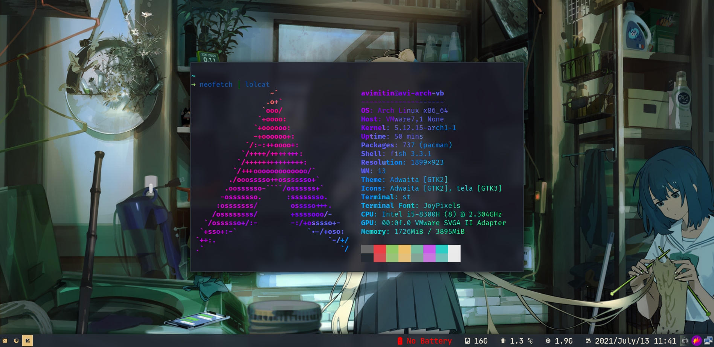

# st (Simple Terminal)

Avimitin's simple terminal build.

## Screenshot



## Patches :

- alpha 
- Ligatures
- sixel 
- scrollback
- Clipboard
- Alpha(Transparency)
- Boxdraw
- w3m
- font2
- right click paste
- st desktop entry
- newterm
- anysize
- anygeometry
- xresources
- sync patch ( Better draw timing to reduce flicker/tearing and improve animation smoothness )
- live reload ( change colors/fonts on the fly )
  and more...
  <br>

## How to apply Xresources and live-reload ?

```
#make an alias for this command

alias load="kill -USR1 $(pidof st)"
alias use="xrdb merge"

command : use Xresourcesfile && load
```

## Dependencies : <br>


```
#void (most of these are already installed on arch distros)
xbps-install libXft-devel libX11-devel harfbuzz-devel libXext-devel libXrender-devel libXinerama-devel
 

#Debian (and ubuntu probably)
apt install build-essential libxft-dev libharfbuzz-dev 
```

## Install <br>

`cd st (this repo) `<br>
`sudo make install `<br>

## other ST builds <br>

1. Default ST (main branch)
2. Sixel St (sixel branch , with sixel graphics support)
3. St with vim-browse (vim-browse branch , navigate within like vim)

- Use a different st build ( clone its branch)

`example: git clone https://github.com/siduck76/st --branch sixel`

## Default Keybindings<br>

<pre>
ctrl + shift + c        Copy  <br>
ctrl + shift + v        Paste <br>
alt  + comma            Zoom in <br>
alt  + .                Zoom out <br>
alt  + g                Reset Zoom<br>
alt  + s                Increase Transparency<br>
alt  + a                Decrease Transparency<br>
alt  + m                Reset Transparency<br>
copy anything and right click on the terminal ( will paste the copied thing ) 
Ctrl + shift + enter    open a new terminal with same cwd ( current working directory )
alt + k                 scroll down 
alt + j                 scroll up
alt + l                 open url
alt + y                 copy url
alt + o                 copy command output
</pre>

you can change all of these in config.h
<br>

## Themes/Fonts used

- [JetbrainsMono Nerd Font Mono](https://www.nerdfonts.com/font-downloads)
- [JoyPixels](https://archlinux.org/packages/community/any/ttf-joypixels/)
- [vim-deus](https://github.com/ajmwagar/vim-deus)

The ST using vim-deus as default color scheme but with darker background: `#1a1b26`

# Credits

- [live-reload](https://github.com/nimaipatel/st) 
- [anysize/copy...](https://github.com/siduck76/st)
